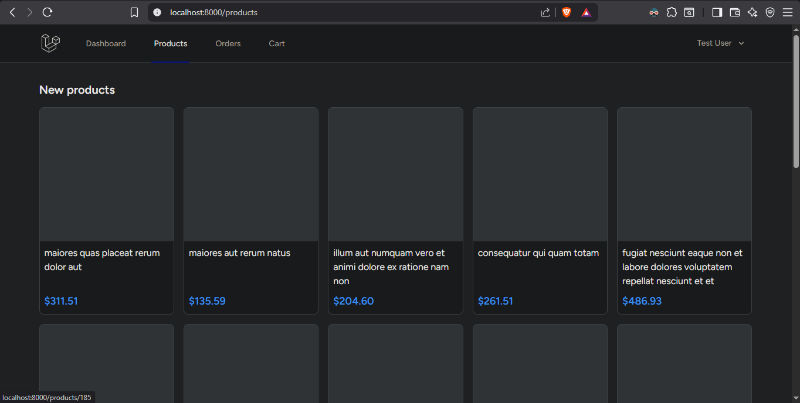
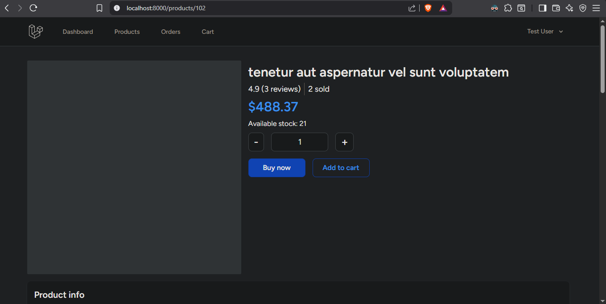
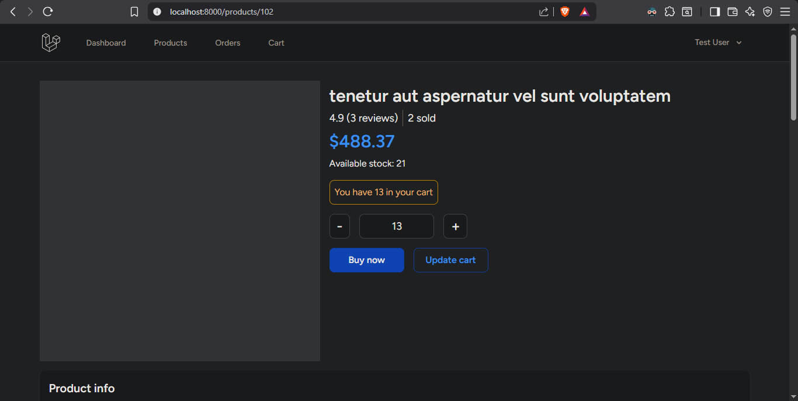
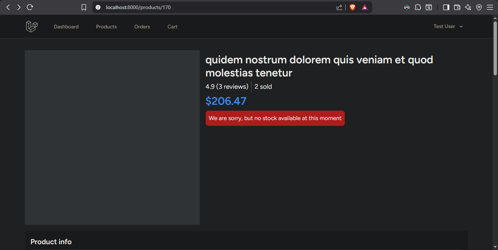
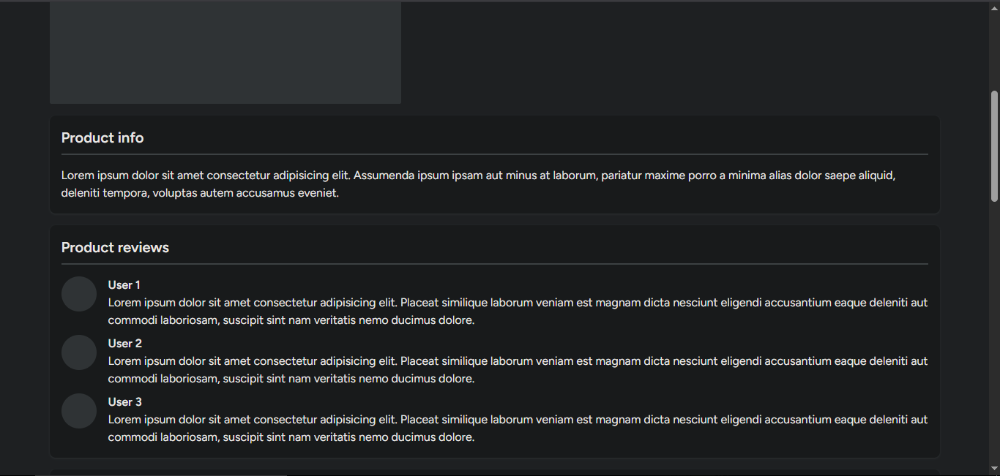
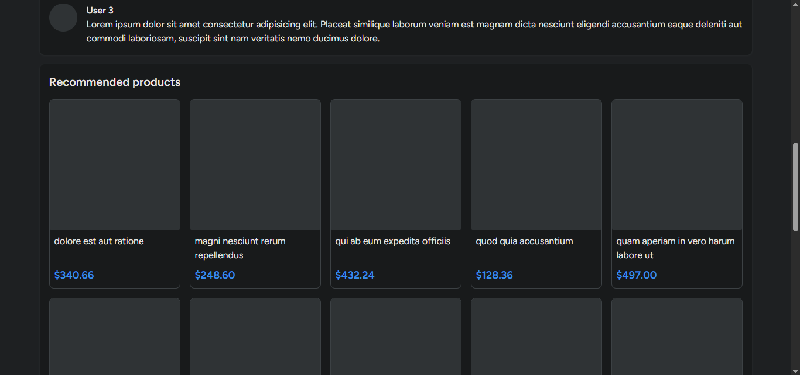
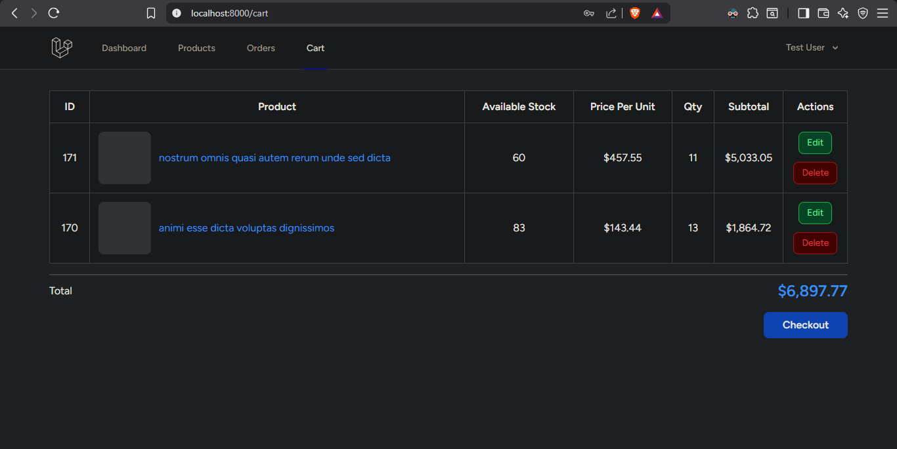
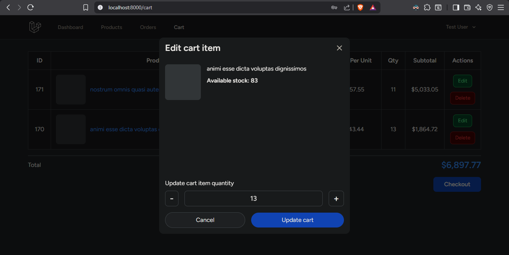
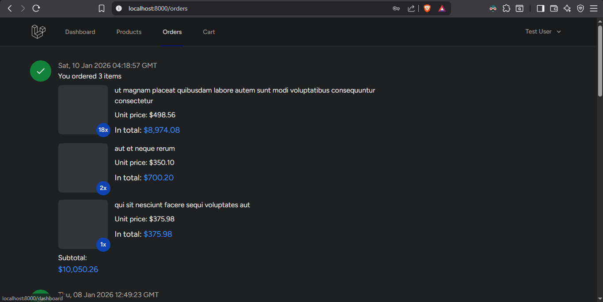

# Laravel Shopping Cart - Take-Home Project

## Overview

This repository contains a simplified e-commerce flow built with Laravel, Vue 3, and Inertia.js, designed to demonstrate production-minded backend modeling, transactional correctness, and frontend–backend integration rather than UI polish.

The project intentionally mirrors real-world SME e-commerce systems, focusing on correctness, clarity, and maintainability under realistic constraints.

---

## Domain Modeling: Order & OrderItem

The `Order` and `OrderItem` models are structured to reflect real production systems:

- **Order**
    - Belongs to a user
    - Represents a finalized checkout snapshot
    - Stores totals and status at the time of purchase

- **OrderItem**
    - Belongs to an order
    - Stores product, price, and quantity at purchase time
    - Decoupled from future product price changes

This separation intentionally decouples historical orders from future product changes, ensuring data integrity for reporting, refunds, and audits.

---

## Checkout & Data Integrity

- Checkout creates a transactional snapshot of the order and its items.
- Product price changes after checkout do not affect historical orders.
- Stock is validated atomically during checkout to prevent negative inventory.

This design prioritizes financial correctness and predictable system behavior.

---

## Checkout & Data Integrity

- Checkout creates a transactional snapshot of the order and its items.
- Product price changes after checkout do not affect historical orders.
- Stock is validated atomically during checkout to prevent negative inventory.

This design prioritizes financial correctness and predictable system behavior.

---

## Trade-offs & Assumptions

Several deliberate trade-offs were made to keep the scope reviewable while preserving production realism:

- Payments are intentionally out of scope to focus on domain correctness rather than third-party integrations.
- Stock handling is implemented using database transactions with row-level locking (`lockForUpdate`) at checkout to ensure correctness under concurrent requests.
- Pre-checkout stock reservation (e.g. holding inventory while items sit in carts) is intentionally not implemented. This avoids added complexity such as expiry handling and cleanup jobs and reflects typical SME-scale assumptions where contention is moderate.
- UI complexity is deprioritized in favor of backend clarity, correctness, and testability.
- The system assumes moderate scale, where correctness and maintainability outweigh premature optimization.

These decisions are intentional, not omissions, and reflect pragmatic engineering judgment.

---

## Tests

The project includes focused tests covering:
- Successful checkout and order creation
- Checkout failure on insufficient stock
- Stock notification intent and dispatch behavior

Tests prioritize business-critical paths over exhaustive coverage.

---

## Tech Stack

- Backend: Laravel
- Frontend: Vue 3 + Inertia.js
    - Inertia is used to deliver SPA-like UX while preserving Laravel routing, authentication, and server-side control.
    - Inertia is used to deliver SPA-like UX while preserving Laravel routing, authentication, and server-side control.
- Authentication: Laravel Breeze (session-based)
- Styling: Tailwind CSS
- Database: MySQL / PostgreSQL
- Queue: Laravel Jobs (database driver; for production, we use Redis)
- Scheduler: Laravel Task Scheduling (cron)

The stack reflects common production Laravel deployments rather than experimental tooling.
---

## Screenshots

### **1. Browse products**


### **2. Product detail (main)**

<p>Displays product details, availability, and purchase actions.</p>


<p>If the product already exists in the user’s cart, a contextual UI indicator is shown with the current in-cart quantity.</p>


<p>When a product is out of stock, users can opt in to receive a notification once the product becomes available again.</p>
    
### **3. Product info & reviews**


### **4. Recommended products**


### **5. Cart**


### **6. Edit cart item**


### **7. Orders**


---

## Running the project

### Prerequisites

- PHP ^8.2
- Composer
- Node.js ^18.x and npm
- MySQL or PostgreSQL
- Git

---

### Setup

```bash
git clone https://github.com/ChristianDelvianto/laravel-shopping-cart.git
cd laravel-shopping-cart

cp .env.example .env
composer install
npm install
php artisan key:generate
php artisan migrate --seed
```

### Run (Multiple Processes Required)

```bash
# Terminal 1: App server
php artisan serve

# Terminal 2: Queue worker
php artisan queue:work

# Terminal 3: Scheduler
php artisan schedule:work

# Terminal 4: Frontend assets
npm run dev
```

This multi-process setup mirrors real Laravel production environments where web, queue, and scheduled workers run independently.

Note:
- Make sure the Laravel server is running before accessing the app
- Queue worker and scheduler must run in separate terminals
- To change the low stock threshold, update `LOW_STOCK_THRESHOLD` in `.env`

---

## Configuration Notes

- `LOW_STOCK_THRESHOLD` controls admin stock alerts
- Queue driver: `database`
- Scheduler requires a running worker
- Mail delivery depends on the configured mail driver

---

## Development Notes (Remote-First)

- Project is structured for independent development and async review.
- Clear separation of concerns to support readable pull requests and distributed collaboration.
- Documentation is written to allow reviewers to understand intent without real-time explanation.

---

## Final Notes

This project was completed in approximately 4–5 days, including design, implementation, and refinement.