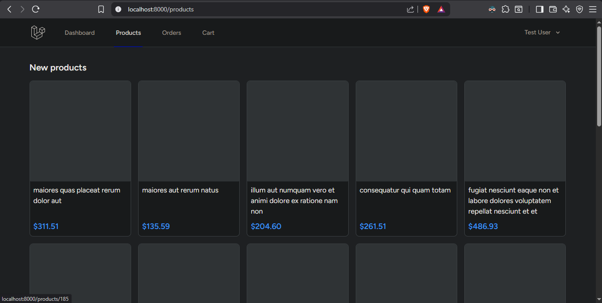
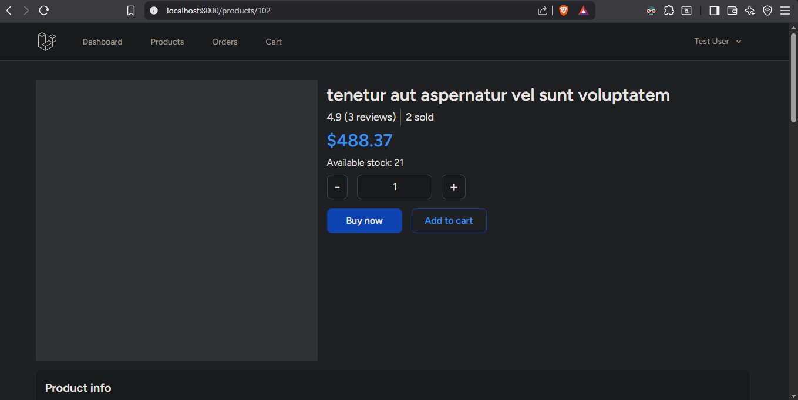
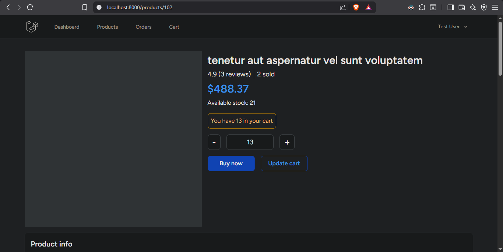
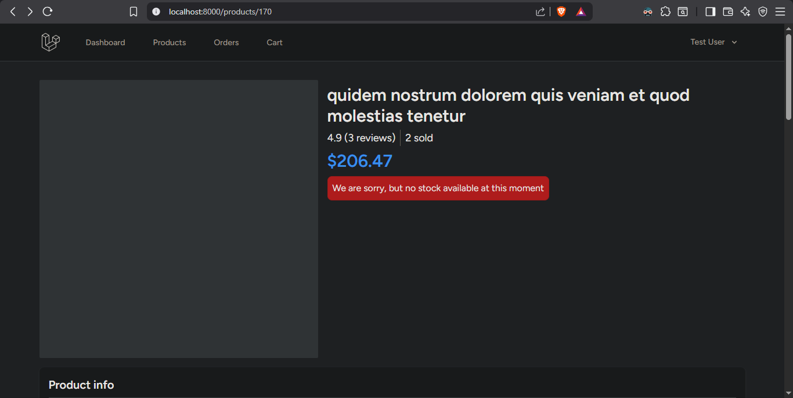
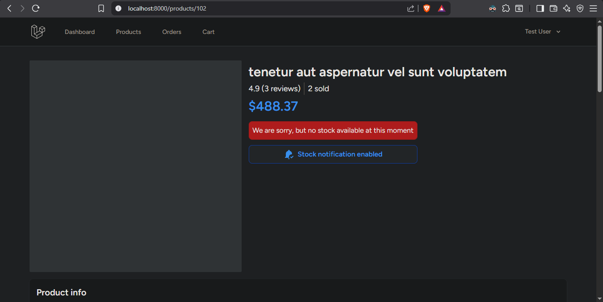
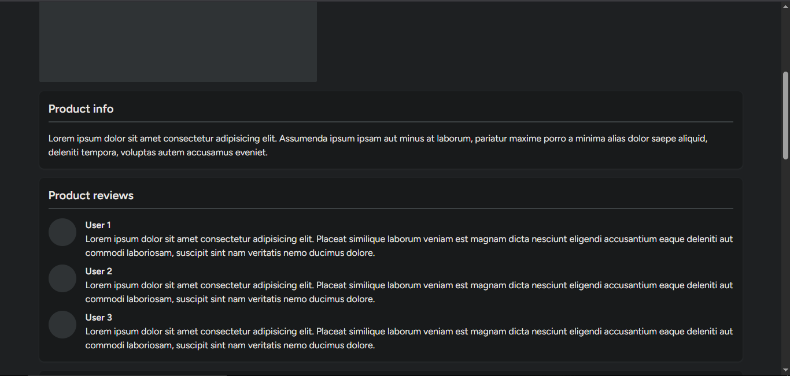
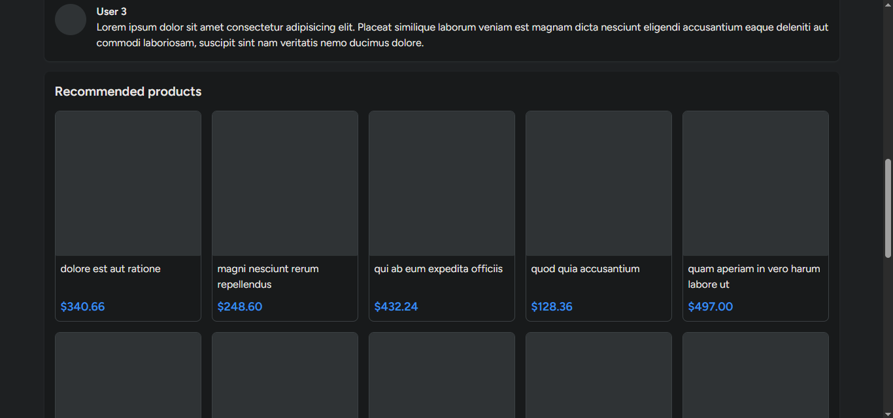
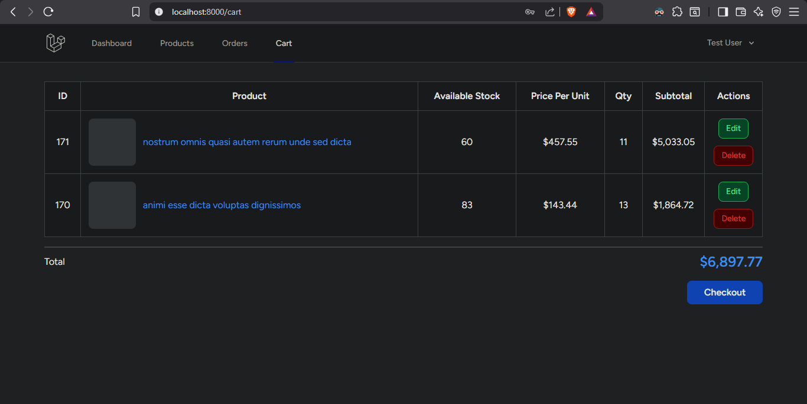
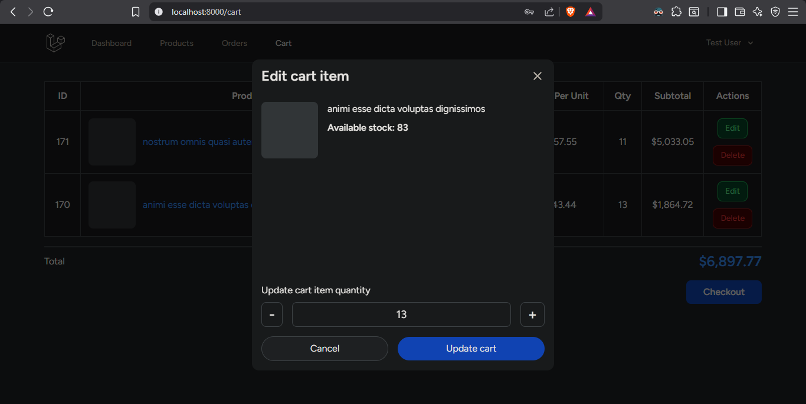
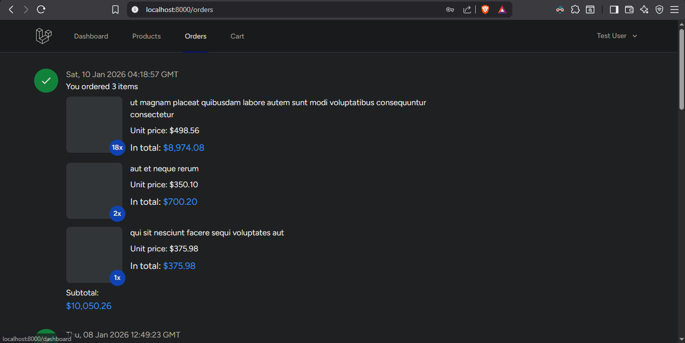

# Simple E-Commerce Shopping Cart

A production-oriented Laravel e-commerce system built as part of a practical assessment.
This project focuses on backend correctness, data integrity, concurrency safety, and real-world trade-offs, rather than UI polish.

---

## Why This Project Matters

This implementation demonstrates how I approach real systems:

- Correctness before convenience
- Explicit state over implicit behavior
- Safe concurrent writes
- Bounded background processes
- Features designed with lifecycle

---

## Test Alignment (All Requirements Fulfilled)

This project fully satisfies the practical task requirements:
- Users can browse products
- Each user has a persistent cart stored in the database (no session / localStorage)
- Users can add, update, and remove cart items
- Product stock is validated server-side
- Users can checkout and create orders
- Low-stock notifications are handled via queued jobs
- Daily sales reports are generated via a scheduled cron job
- Laravel starter kit authentication is used

---

## Tech Stack

- **`Backend`:** Laravel
- **`Frontend`:** Vue 3 + Inertia.js
- **`Authentication`:** Laravel Breeze (session-based)
- **`Styling`:** Tailwind CSS
- **`Database`:** MySQL / PostgreSQL
- **`Queue`:** Laravel Jobs (database driver; for production, we use Redis)
- **`Scheduler`:** Laravel Task Scheduling (cron)

---

## Architecture Overview

### Backend Design Principles
- Business logic is separated into a service layer
- Controllers remain thin and orchestration-focused
- Database transactions ensure consistency during:
    1. Cart updates
    2. Checkout operations
    3. Stock mutations
- Row-level locking (`lockForUpdate`) is applied where concurrent writes may occur
- All cart and checkout operations are authoritative on the server

This prevents race conditions, double-spending stock, and inconsistent order data.

### Background Processing

Jobs are used for:
- Low-stock admin notifications
- Product stock availability notifications (user-facing)
- Daily sales report emails

Scheduled tasks:
- Daily sales report generation
- Automatic cleanup of stale stock notification records

All background tasks are idempotent, bounded, and failure-tolerant.

--- 

## Core Features

### Shopping Cart
- One cart per authenticated user
- One cart item per product (no duplicates)
- Quantity updates replace existing values (idempotent)
- Cart state is always derived from the database
- No frontend-only state assumptions

### Checkout Flow
- Cart is converted into an order inside a single transaction
- Order items snapshot product price at checkout time
- Order status is simplified to `completed` (scope-appropriate)

---

## Product Stock Notification System (Advanced Feature)

### Problem Solved
Out-of-stock products create lost sales and poor user experience.

However, naïve notification systems often cause:

- Duplicate emails
- Notifications for stale stock changes
- Unbounded table growth
- Race conditions during restocks

## Solution Overview

### Product Versioning
Products include a `version` column that increments only when stock transitions from unavailable → available.

```php
protected static function booted()
{
    static::updating(function ($model) {
        if ($model->isDirty('stock_quantity')) {
            $old = $model->getOriginal('stock_quantity');
            $new = $model->stock_quantity;

            if ($old < 1 && $new >= 1) {
                $model->version++;
            }
        }
    });
}
```

**The `version` field is intentionally not fillable and is fully controlled by the model.**

### Notification Subscription Table
```php
Schema::create('product_notify', function (Blueprint $table) {
    $table->id();
    $table->unsignedInteger('product_version')->default(1);
    $table->foreignId('product_id')->constrained()->cascadeOnDelete();
    $table->foreignId('user_id')->constrained()->cascadeOnDelete();
    $table->timestamps();

    // Prevent duplicates and enforce intent
    $table->unique(['product_id', 'user_id', 'product_version']);

    // Query optimization
    $table->index(['user_id', 'product_version']);
    $table->index('created_at'); // First-come, first-notified
});
```

### Notification Behavior

- Users subscribe **only for the current product version**
- When stock becomes available:
    1. A queued job notifies users **in order of subscription**
    2. Only users subscribed to the previous version are notified
- Old notification records are automatically cleaned up via cron

This design ensures:
- Correctness under concurrency
- No stale notifications
- Predictable system behavior at scale

---

### Business Impact

This feature is designed not only for correctness, but to deliver measurable business value:

- **Increase user engagement**
    Users are given a reason to return without manually checking stock.

- **Recover lost sales from out-of-stock events**
    Demand is captured at the moment of intent instead of being lost to competitors.

- **Fair notification ordering**
    First-come-first-notified prevents abuse and improves trust.

- **Operational safety at scale**
    Version-based intent prevents notifying users for irrelevant stock changes.

- **Reduced support and UX friction**
    Users are proactively informed instead of requiring manual follow-ups.

## Screenshots

### **1. Browse products**


**Potential improvements:**
    1. Browse products by categories
    2. Display top products (last 3 days) using cron jobs and caching
    3. Implement a recommendation algorithm based on user behavior

### **2. Product detail (main)**

<p>Displays product details, availability, and purchase actions.</p>


<p>If the product already exists in the user’s cart, a contextual UI indicator is shown with the current in-cart quantity.</p>


<p>When a product is out of stock, users can opt in to receive a notification once the product becomes available again.</p>


<p>Persistent order history derived from authoritative backend state.</p>

**Potential improvements:**
    1. Add SEO-friendly slugs to product URLs (e.g. `/products/macbook-pro-m3-4`)
    2. Add product variants
    3. Add product galleries (support multiple images / videos)
    4. Implement a sold-counter & reviews
    
### **3. Product info & reviews**


**Potential improvements:**
    1. Create more detailed product information section
    2. Allow reviews only after order completion
    3. Support images/videos in reviews to increase user engagement
    4. Create a dedicated product reviews page where users can view all reviews

### **4. Recommended products**


**Potential improvements:**
    1. Implement a real recommendation algorithm
    2. Track user orders, searches, and viewed products to infer interests

### **5. Cart**


### **6. Edit cart item**


### **7. Orders**


**Potential improvements:**
    1. Implement `Buy back` feature and add internal tracking / analytic to generate product interest data
    2. Add `filter` so users can search their order history (i.e: `product name`, `date`)

---

## Configuration Notes

- `LOW_STOCK_THRESHOLD` controls admin stock alerts
- Queue driver: `database`
- Scheduler requires a running worker
- Mail delivery depends on the configured mail driver

---

## Limitations & Trade-offs

- Payment processing intentionally omitted
- Order lifecycle simplified to `completed`
- Recommendation logic intentionally minimal

These decisions were made to prioritize clarity, correctness, and evaluation scope.

---

## Running the project

### Prerequisites

- PHP ^8.2
- Composer
- Node.js ^18.x and npm
- MySQL or PostgreSQL
- Git

---

### Setup

```bash
git clone https://github.com/ChristianDelvianto/laravel-shopping-cart.git
cd laravel-shopping-cart

cp .env.example .env
composer install
npm install
php artisan key:generate
php artisan migrate --seed
```

### Run (Multiple Processes Required)

```bash
# Terminal 1: App server
php artisan serve

# Terminal 2: Queue worker
php artisan queue:work

# Terminal 3: Scheduler
php artisan schedule:work

# Terminal 4: Frontend assets
npm run dev
```

Note:
- Make sure the Laravel server is running before accessing the app
- Queue worker and scheduler must run in separate terminals
- To change the low stock threshold, update `LOW_STOCK_THRESHOLD` in `.env`

---

## Final Notes

This project was completed in approximately 4–5 days, including design, implementation, and refinement.

The focus was placed on:
- Backend correctness
- Data consistency
- Concurrency safety
- Clear architectural decisions

UI complexity was intentionally kept minimal.